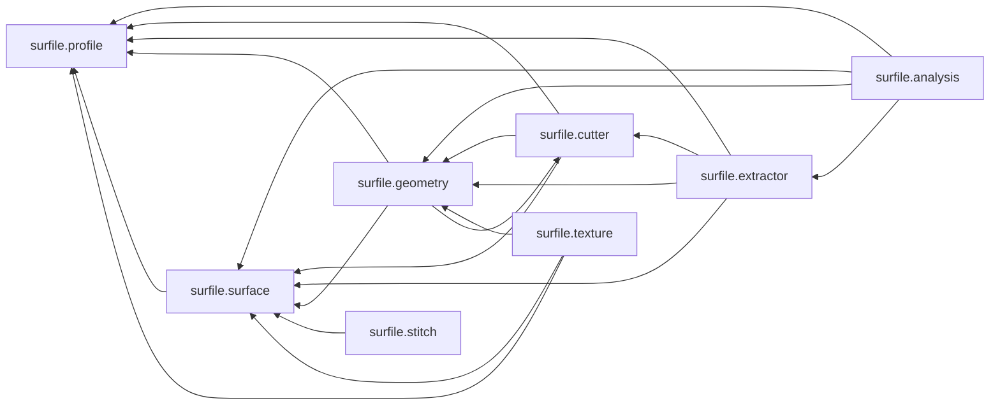

<!-- PROJECT LOGO -->

# SurfILE: surface and profile analysis
Python library for analyzing topographic features of surfaces from
- areal surface data -- __Surf__-ace
- profiles -- prof-__ile__

<!-- ABOUT THE PROJECT -->
## About The Project
The project is intended to be an easy to use tool box providing multiple algorithms to analyze areal surface topographies: areal height maps and profiles.

<!-- USAGE EXAMPLES -->

  
 

<!-- GOAL -->
## Goal
The project aims to provide easy-to-use Python programs for analysing areal surface topographies and profiles:
- as a tool box of algorithms to estimate geometry parameters of spheres, cylinders, gratings (height and pitch), etc
- in the field of surface metrology for users
    - who want the flexibility to adapt their data processing to their own needs by modifying and adding code as required
    - who need to process large amounts of measurement data for automatic analysis (such as 20 to 100 topography maps of repetitive measurements)
- for beginners as well as for those experts who need a quick and easy way to solve their tasks 

<!-- CONTRIBUTING -->
## Contributing
When contributing to this repository, please first discuss the change you wish to make via "issue" before making a change.
Please consider also contributing to the documentation.

<!-- DOCS -->
## Docs
The documentation is available in html format in the folder docs and was automatically generated with pdoc using numpy style docstrings.

### Package structure

<!-- LICENCE -->
## License
GNU GPLv3

This program is free software: you can redistribute it and/or modify
it under the terms of the GNU General Public License as published by
the Free Software Foundation, either version 3 of the License, or
(at your option) any later version.

This program is distributed in the hope that it will be useful,
but WITHOUT ANY WARRANTY; without even the implied warranty of
MERCHANTABILITY or FITNESS FOR A PARTICULAR PURPOSE.  See the
GNU General Public License for more details.

See <https://www.gnu.org/licenses/>.
